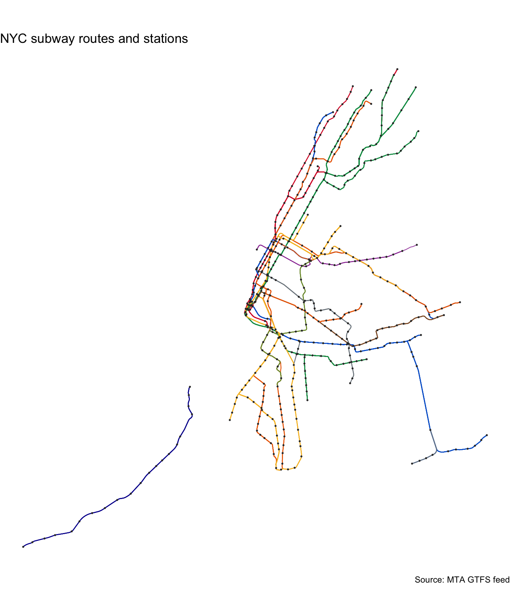

# nycroutes 

Spatial and tabular data describing the New York City subway system,
derived from the MTA’s GTFS feed. Includes route shapes, stops, parent
stations, directional platforms, transfers, and pre-computed offset
versions of routes and stops suitable for schematic mapping.

## Installation

You can install the development version of nycroutes from
[GitHub](https://github.com/) with:

``` r
# install.packages("remotes")
remotes::install_github("kjhealy/nycroutes")
```

## Load

``` r
library(nycroutes)
library(dplyr)
library(ggplot2)
library(sf)
```

## What’s included

``` r
nyc_subway_routes_df
#> # A tibble: 29 × 10
#>    route_id agency_id route_short_name route_long_name     route_desc route_type
#>    <chr>    <chr>     <chr>            <chr>               <chr>           <int>
#>  1 A        MTA NYCT  A                8 Avenue Express    Trains op…          1
#>  2 C        MTA NYCT  C                8 Avenue Local      Trains op…          1
#>  3 E        MTA NYCT  E                8 Avenue Local      Trains op…          1
#>  4 B        MTA NYCT  B                6 Avenue Express    Trains op…          1
#>  5 D        MTA NYCT  D                6 Avenue Express    Trains op…          1
#>  6 F        MTA NYCT  F                Queens Blvd Expres… Trains op…          1
#>  7 FX       MTA NYCT  FX               Brooklyn F Express  Trains op…          1
#>  8 M        MTA NYCT  M                Queens Blvd Local/… Trains op…          1
#>  9 G        MTA NYCT  G                Brooklyn-Queens Cr… Trains op…          1
#> 10 J        MTA NYCT  J                Nassau St Local     Trains op…          1
#> # ℹ 19 more rows
#> # ℹ 4 more variables: route_url <chr>, route_color <chr>,
#> #   route_text_color <chr>, route_sort_order <int>

nyc_subway_routes_sf
#> Simple feature collection with 311 features and 5 fields
#> Geometry type: LINESTRING
#> Dimension:     XY
#> Bounding box:  xmin: 914189.9 ymin: 126191.2 xmax: 1052169 ymax: 268346.1
#> Projected CRS: NAD83 / New York Long Island (ftUS)
#> First 10 features:
#>      shape_id route_id route_short_name           route_long_name route_color
#> 1     1..N03R        1                1 Broadway - 7 Avenue Local     #D82233
#> 2  1..N03X001     <NA>             <NA>                      <NA>        <NA>
#> 3     1..N04R     <NA>             <NA>                      <NA>        <NA>
#> 4     1..N05R     <NA>             <NA>                      <NA>        <NA>
#> 5     1..N06R     <NA>             <NA>                      <NA>        <NA>
#> 6     1..N12R     <NA>             <NA>                      <NA>        <NA>
#> 7     1..N13R     <NA>             <NA>                      <NA>        <NA>
#> 8     1..S03R        1                1 Broadway - 7 Avenue Local     #D82233
#> 9  1..S03X001     <NA>             <NA>                      <NA>        <NA>
#> 10    1..S04R        1                1 Broadway - 7 Avenue Local     #D82233
#>                          geometry
#> 1  LINESTRING (980461.4 195059...
#> 2  LINESTRING (980461.4 195059...
#> 3  LINESTRING (980461.4 195059...
#> 4  LINESTRING (980461.4 195059...
#> 5  LINESTRING (980461.4 195059...
#> 6  LINESTRING (980461.4 195059...
#> 7  LINESTRING (980461.4 195059...
#> 8  LINESTRING (1012291 263271....
#> 9  LINESTRING (997071.2 238760...
#> 10 LINESTRING (1011661 261601....

nyc_subway_stops_sf
#> Simple feature collection with 1488 features and 4 fields
#> Geometry type: POINT
#> Dimension:     XY
#> Bounding box:  xmin: 914189.9 ymin: 126191.2 xmax: 1052169 ymax: 268346.1
#> Projected CRS: NAD83 / New York Long Island (ftUS)
#> # A tibble: 1,488 × 5
#>    stop_id stop_name      location_type parent_station                 geometry
#>  * <chr>   <chr>                  <int> <chr>          <POINT [US_survey_foot]>
#>  1 101     Van Cortlandt…             1 <NA>                 (1012291 263271.2)
#>  2 101N    Van Cortlandt…            NA 101                  (1012291 263271.2)
#>  3 101S    Van Cortlandt…            NA 101                  (1012291 263271.2)
#>  4 103     238 St                     1 <NA>                 (1011661 261601.4)
#>  5 103N    238 St                    NA 103                  (1011661 261601.4)
#>  6 103S    238 St                    NA 103                  (1011661 261601.4)
#>  7 104     231 St                     1 <NA>                   (1010567 259483)
#>  8 104N    231 St                    NA 104                    (1010567 259483)
#>  9 104S    231 St                    NA 104                    (1010567 259483)
#> 10 106     Marble Hill-2…             1 <NA>                 (1009187 257916.7)
#> # ℹ 1,478 more rows

nyc_subway_stops_parent_sf
#> Simple feature collection with 496 features and 4 fields
#> Geometry type: POINT
#> Dimension:     XY
#> Bounding box:  xmin: 914189.9 ymin: 126191.2 xmax: 1052169 ymax: 268346.1
#> Projected CRS: NAD83 / New York Long Island (ftUS)
#> # A tibble: 496 × 5
#>    stop_id stop_name      location_type parent_station                 geometry
#>  * <chr>   <chr>                  <int> <chr>          <POINT [US_survey_foot]>
#>  1 101     Van Cortlandt…             1 <NA>                 (1012291 263271.2)
#>  2 103     238 St                     1 <NA>                 (1011661 261601.4)
#>  3 104     231 St                     1 <NA>                   (1010567 259483)
#>  4 106     Marble Hill-2…             1 <NA>                 (1009187 257916.7)
#>  5 107     215 St                     1 <NA>                 (1007682 256050.9)
#>  6 108     207 St                     1 <NA>                 (1006704 254292.8)
#>  7 109     Dyckman St                 1 <NA>                   (1004848 252801)
#>  8 110     191 St                     1 <NA>                 (1003777 250866.9)
#>  9 111     181 St                     1 <NA>                   (1002621 248782)
#> 10 112     168 St-Washin…             1 <NA>                 (1000815 245520.2)
#> # ℹ 486 more rows

nyc_subway_stops_platform_sf
#> Simple feature collection with 992 features and 4 fields
#> Geometry type: POINT
#> Dimension:     XY
#> Bounding box:  xmin: 914189.9 ymin: 126191.2 xmax: 1052169 ymax: 268346.1
#> Projected CRS: NAD83 / New York Long Island (ftUS)
#> # A tibble: 992 × 5
#>    stop_id stop_name      location_type parent_station                 geometry
#>  * <chr>   <chr>                  <int> <chr>          <POINT [US_survey_foot]>
#>  1 101N    Van Cortlandt…            NA 101                  (1012291 263271.2)
#>  2 101S    Van Cortlandt…            NA 101                  (1012291 263271.2)
#>  3 103N    238 St                    NA 103                  (1011661 261601.4)
#>  4 103S    238 St                    NA 103                  (1011661 261601.4)
#>  5 104N    231 St                    NA 104                    (1010567 259483)
#>  6 104S    231 St                    NA 104                    (1010567 259483)
#>  7 106N    Marble Hill-2…            NA 106                  (1009187 257916.7)
#>  8 106S    Marble Hill-2…            NA 106                  (1009187 257916.7)
#>  9 107N    215 St                    NA 107                  (1007682 256050.9)
#> 10 107S    215 St                    NA 107                  (1007682 256050.9)
#> # ℹ 982 more rows

nyc_subway_transfers_df
#> # A tibble: 613 × 4
#>    from_stop_id to_stop_id transfer_type min_transfer_time
#>    <chr>        <chr>              <int>             <int>
#>  1 101          101                    2               180
#>  2 103          103                    2               180
#>  3 104          104                    2               180
#>  4 106          106                    2               180
#>  5 107          107                    2               180
#>  6 108          108                    2               180
#>  7 109          109                    2               180
#>  8 110          110                    2               180
#>  9 111          111                    2               180
#> 10 112          112                    2               180
#> # ℹ 603 more rows

nyc_subway_routes_offset_sf
#> Simple feature collection with 311 features and 6 fields
#> Geometry type: LINESTRING
#> Dimension:     XY
#> Bounding box:  xmin: 914739.9 ymin: 126191.2 xmax: 1052869 ymax: 268346.1
#> Projected CRS: NAD83 / New York Long Island (ftUS)
#> # A tibble: 311 × 7
#>    shape_id   route_id route_short_name route_long_name           route_color
#>    <chr>      <chr>    <chr>            <chr>                     <chr>      
#>  1 1..N03R    1        1                Broadway - 7 Avenue Local #D82233    
#>  2 1..N03X001 <NA>     <NA>             <NA>                      <NA>       
#>  3 1..N04R    <NA>     <NA>             <NA>                      <NA>       
#>  4 1..N05R    <NA>     <NA>             <NA>                      <NA>       
#>  5 1..N06R    <NA>     <NA>             <NA>                      <NA>       
#>  6 1..N12R    <NA>     <NA>             <NA>                      <NA>       
#>  7 1..N13R    <NA>     <NA>             <NA>                      <NA>       
#>  8 1..S03R    1        1                Broadway - 7 Avenue Local #D82233    
#>  9 1..S03X001 <NA>     <NA>             <NA>                      <NA>       
#> 10 1..S04R    1        1                Broadway - 7 Avenue Local #D82233    
#> # ℹ 301 more rows
#> # ℹ 2 more variables: geometry <LINESTRING [US_survey_foot]>, x_offset <dbl>

nyc_subway_stops_offset_sf
#> Simple feature collection with 1909 features and 7 fields
#> Geometry type: POINT
#> Dimension:     XY
#> Bounding box:  xmin: 914739.9 ymin: 126191.2 xmax: 1051919 ymax: 268346.1
#> Projected CRS: NAD83 / New York Long Island (ftUS)
#> # A tibble: 1,909 × 8
#>    stop_id stop_name      location_type parent_station                 geometry
#>    <chr>   <chr>                  <int> <chr>          <POINT [US_survey_foot]>
#>  1 101N    Van Cortlandt…            NA 101                  (1011641 263271.2)
#>  2 101S    Van Cortlandt…            NA 101                  (1011641 263271.2)
#>  3 103N    238 St                    NA 103                  (1011011 261601.4)
#>  4 103S    238 St                    NA 103                  (1011011 261601.4)
#>  5 104N    231 St                    NA 104                    (1009917 259483)
#>  6 104S    231 St                    NA 104                    (1009917 259483)
#>  7 106N    Marble Hill-2…            NA 106                  (1008537 257916.7)
#>  8 106S    Marble Hill-2…            NA 106                  (1008537 257916.7)
#>  9 107N    215 St                    NA 107                  (1007032 256050.9)
#> 10 107S    215 St                    NA 107                  (1007032 256050.9)
#> # ℹ 1,899 more rows
#> # ℹ 3 more variables: route_id <chr>, x_offset <dbl>, route_color <chr>
```

## Example

A quick map of the subway system, coloring each route by its MTA brand
color and marking parent stations:

``` r
ggplot() +
  geom_sf(
    data = nyc_subway_routes_sf,
    mapping = aes(color = route_color),
    linewidth = 0.4,
    alpha = 0.8
  ) +
  geom_sf(
    data = nyc_subway_stops_parent_sf,
    size = 0.3,
    color = "grey20"
  ) +
  scale_color_identity() +
  labs(
    title = "NYC subway routes and stations",
    caption = "Source: MTA GTFS feed"
  ) +
  theme_void()
#> Warning: Removed 110 rows containing missing values or values outside the scale range
#> (`geom_sf()`).
```


